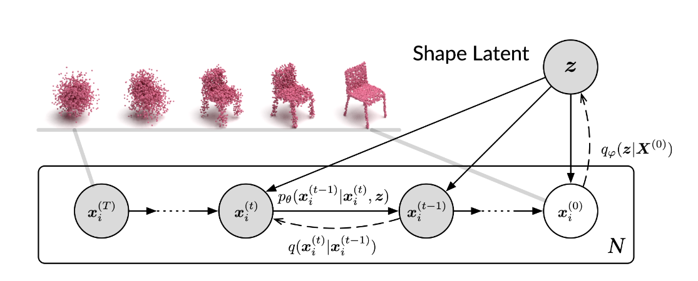
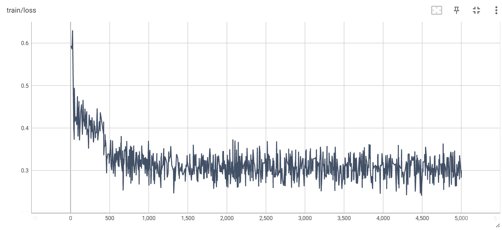
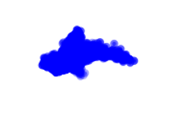
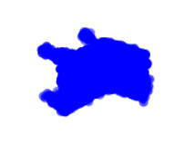

# Diffusion Probabilistic Models for 3D Point Cloud Generation

参考链接：https://github.com/luost26/diffusion-point-cloud

使用扩散模型进行3D点云生成：首先训练PointNet编码器，将3D点云编码为潜在向量。然后以潜在向量为条件，使用扩散模型将随机噪声去噪为对应的点云



## 一、环境配置

```
python == 3.8

pip install torch torchvision torchaudio --index-url https://download.pytorch.org/whl/cu118 （PyTorch 2.0+，支持NVIDIA A100 GPU）

pip install h5py tqdm tensorboard scipy scikit-learn numpy six
```

## 二、数据集

这里使用ShapeNet数据集中的airplane类别，utils/dataset.py中读取数据文件代码调整成如下：

```python
with h5py.File(self.path, 'r') as f:
    pointclouds = []
    pointclouds.append(torch.from_numpy(f['data'][...]))
```

## 三、训练

```python
python train_ae.py # 训练了5000个epoch
```

### 训练损失展示：



## 四、测试

添加了COV-CD和1NN-CD两个指标，在evaluation/evaluation_metrics.py中添加以下代码

```python
def EMD_CD(sample_pcs, ref_pcs, batch_size, reduced=True):
    N_sample = sample_pcs.shape[0]
    N_ref = ref_pcs.shape[0]
    assert N_sample == N_ref, "REF:%d SMP:%d" % (N_ref, N_sample)

    cd_lst = []
    emd_lst = []
    coverage_match_ids = []

    # For 1NN:
    all_cd_pairs = []

    iterator = range(0, N_sample, batch_size)

    for b_start in tqdm(iterator, desc='EMD-CD'):
        b_end = min(N_sample, b_start + batch_size)
        sample_batch = sample_pcs[b_start:b_end]  # (B, N, 3)
        ref_batch = ref_pcs[b_start:b_end]

        # CD for MMD
        dl, dr = distChamfer(sample_batch, ref_batch)
        cd = dl.mean(dim=1) + dr.mean(dim=1)
        cd_lst.append(cd)

        # EMD
        emd_batch = emd_approx(sample_batch, ref_batch)
        emd_lst.append(emd_batch)

        # COV
        for i in range(sample_batch.size(0)):
            s = sample_batch[i].unsqueeze(0).repeat(ref_batch.size(0), 1, 1)
            r = ref_batch
            d1, d2 = distChamfer(s, r)
            cd_vals = d1.mean(dim=1) + d2.mean(dim=1)
            match_id = cd_vals.argmin().item()
            coverage_match_ids.append(match_id)

        # 1NN: add all pairs from current batch
        # sample_batch: (B, N, 3), ref_batch: (B, N, 3)
        for i in range(sample_batch.size(0)):
            all_cd_pairs.append(('sample', sample_batch[i]))
            all_cd_pairs.append(('ref', ref_batch[i]))

    if reduced:
        cd = torch.cat(cd_lst).mean()
        emd = torch.cat(emd_lst).mean()
    else:
        cd = torch.cat(cd_lst)
        emd = torch.cat(emd_lst)

    # COV
    unique_matches = len(set(coverage_match_ids))
    coverage = unique_matches / N_ref

    # 1NN
    labels = []
    preds = []

    n_total = len(all_cd_pairs)
    for i in tqdm(range(n_total), desc='1NN'):
        label_i, pc_i = all_cd_pairs[i]
        min_dist = float('inf')
        nn_label = None
        for j in range(n_total):
            if i == j:
                continue
            label_j, pc_j = all_cd_pairs[j]
            d1, d2 = distChamfer(pc_i.unsqueeze(0), pc_j.unsqueeze(0))
            dist = d1.mean() + d2.mean()
            if dist < min_dist:
                min_dist = dist
                nn_label = label_j
        labels.append(label_i)
        preds.append(nn_label)

    correct = sum([p == l for p, l in zip(preds, labels)])
    acc_1nn = correct / n_total

    results = {
        'MMD-CD': cd,
        'MMD-EMD': emd,
        'COV-CD': coverage,
        '1NN-CD': acc_1nn,
    }
    return results
```

增加了Diffusion生成的点云可视化，在test_ae.py中添加以下代码：

```python
import torch
import matplotlib.pyplot as plt
from mpl_toolkits.mplot3d import Axes3D
import os

def visualize_and_save_pointclouds(sample_pcs, num_show=4, titles=None, figsize=(12, 3), save_path='pointcloud_samples.png'):
    if isinstance(sample_pcs, torch.Tensor):
        sample_pcs = sample_pcs.detach().cpu().numpy()
        
    B = sample_pcs.shape[0]
    num_show = min(B, num_show)

    fig = plt.figure(figsize=figsize)
    for i in range(num_show):
        ax = fig.add_subplot(1, num_show, i + 1, projection='3d')
        pc = sample_pcs[i]
        ax.scatter(pc[:, 0], pc[:, 1], pc[:, 2], s=1, c='blue')
        ax.set_axis_off()
        ax.set_title(titles[i] if titles else f'Sample {i}')
        ax.view_init(elev=30, azim=45)

    plt.tight_layout()
    plt.savefig(save_path, dpi=300)
    plt.close()
    print(f"点云图已保存到: {os.path.abspath(save_path)}")

visualize_and_save_pointclouds(all_recons.to(args.device), num_show=4)
```

### 测试结果展示：

|       Method       | COV-CD (↑) | MMD-CD (↓) | 1-NNA-CD (↓) |
| :----------------: | :--------: | :--------: | :----------: |
|    **Original(PontNet)**    |   48.71%   |   3.276%   |    64.83%    |
| **Implementation(PointNet)** |   46.25%   |   4.24%    |    62.55%    |

### 扩散模型生成可视化：
**airplane:**



**chair:**



## Citation

```
@inproceedings{luo2021diffusion,
  title={Diffusion probabilistic models for 3d point cloud generation},
  author={Luo, Shitong and Hu, Wei},
  booktitle={Proceedings of the IEEE/CVF conference on computer vision and pattern recognition},
  pages={2837--2845},
  year={2021}
}
```

